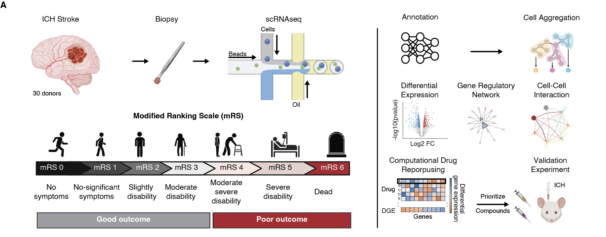

# Single-cell profiling of living human brain identifies myeloid states associated with six-month functional outcome after intracerebral hemorrhage



This repository contains the analysis code, final figures, supplementary
figures, and result tables for the forthcoming manuscript:

> Kyriakis D, Pavlopoulos A, Wang X, Vicari J, Pandey R, Seo JH, Kleopoulos SP,
> Argyriou S, Shao Z, Hoffman G, Fullard JF, Georgakopoulos A, Voloudakis G,
> Skupin A, Lee D, Kellner CP, Roussos P. *Single-cell profiling of living human
> brain identifies myeloid states associated with six-month functional outcome
> after intracerebral hemorrhage.* **Nature Medicine.** Forthcoming.

## Code authorship

**All analysis, quality-control, and figure-generation scripts in this
repository were authored by Dimitrios Kyriakis.** Server-specific paths and
account details have been replaced with public configuration placeholders; the
analysis logic is otherwise preserved.

Corresponding author: Panos Roussos
([panagiotis.roussos@mssm.edu](mailto:panagiotis.roussos@mssm.edu))

## Study summary

Intracerebral hemorrhage (ICH) is the most fatal form of stroke, and secondary
injury driven by the immune response remains an important unmet therapeutic
challenge. We analyzed single-cell RNA-sequencing data from myeloid cells of 30
patients with acute ICH to identify immune states, signaling programs, and
candidate interventions associated with six-month functional outcome.

The analysis identified distinct myeloid trajectory clusters associated with
favorable and unfavorable outcomes. Unfavorable outcome states showed lipid
metabolism and neuroinflammatory programs, including PPARγ- and SPP1-associated
signals, whereas protective states showed complement-related activity.
Cell-cell interaction analyses highlighted outcome-associated signaling such as
SPP1→ITGA4/ITGB1 and APOE→TREM2/SORL1. Transcription-factor and regulatory-network
analyses resolved candidate drivers of myeloid polarization. Computational drug
repurposing prioritized mTOR inhibition, with Everolimus and all-trans retinoic
acid (RA) taken forward for experimental validation.

The final result tables also report enrichment of MYC-target and mTORC1 Hallmark
programs, significant treatment-associated changes in selected rotarod recovery
measures, and treatment-by-distance effects on post-ICH myeloid morphology.

## Interactive data browser

Single-cell data with UMAP embeddings, cell-type annotations, and per-cell
metadata are available through the
[CELLxGENE browser](https://cellxgene.cziscience.com/e/a34a4892-8ec2-4330-9198-81fc31d034e5.cxg/).

## Repository contents

```text
.
├── scripts/
│   ├── main/                    # Primary preprocessing and analysis pipeline
│   ├── figures/
│   │   ├── Figure1/             # Cohort, composition, DE, and enrichment
│   │   ├── Figure2/             # Metacells, scDRS, GRN, and pathway analyses
│   │   ├── Figure3/             # IREA, LIANA, and CellChat analyses
│   │   ├── Figure4/             # In vivo behavioral and morphology statistics
│   │   ├── Supplementary/       # Supplementary-figure analyses
│   │   └── qc/                  # Cross-checks and pipeline-status utilities
│   ├── 00_setup.R               # Shared figure-analysis configuration
│   ├── 00_helpers_stats.R       # Shared statistical helpers
│   ├── 00_theme_colors.R        # Shared plotting palette
│   └── build_supplementary_tables.R
├── Figures/                     # Final main figures 1–4 (PDF and PNG)
├── SFigures/                    # Final supplementary figures 1–5 (PDF and PNG)
├── Tables/                      # Twenty publication result tables (CSV)
├── Overview.jpeg                # Graphical study overview
├── .zenodo.json                 # Code-deposit metadata
└── README.md
```

The `NewFiles/` directory is an untracked local staging bundle and is not part
of the publication repository.

## Analysis scripts

### Primary pipeline

| Script | Purpose |
|---|---|
| `scripts/main/0.Functions.R` | QC helper functions, including doublet detection |
| `scripts/main/0.Preprocess.R` | Per-sample QC, filtering, normalization, and doublet removal |
| `scripts/main/1.Merge_datasets.R` | Merge sample-level Seurat objects and export integrated formats |
| `scripts/main/2.Pegasus_Functions.py` | Pegasus QC and annotation helper functions |
| `scripts/main/2.Pegasus_run.py` | Pegasus clustering and dimensional reduction |
| `scripts/main/3.Manual_Major_Annotation.py` | Major immune-cell annotation |
| `scripts/main/4.Transfer_MAnnot_To_Seurat.R` | Transfer annotations back to Seurat |
| `scripts/main/5.Ref_SCANVI_Annot.py` | Reference-based scVI/scANVI myeloid annotation |
| `scripts/main/6.Metacells.R` | Metacell construction and Harmony integration |
| `scripts/main/8.scDRS.py` | Single-cell disease-relevance scoring with scDRS |
| `scripts/main/9.scDRS_supplementary_table.py` | Assemble scDRS supplementary results |
| `scripts/main/9.Liana.py` | LIANA cell-cell interaction inference |
| `scripts/main/scenic_GRN_ExtendedGenes.lsf.sh` | HPC workflow for extended-gene pySCENIC analysis |
| `scripts/main/extract_loom_regulons.py` | Export regulon matrices from pySCENIC loom files |

### Figure and quality-control code

- `scripts/figures/Figure1/` contains the pseudobulk, CCA, UMAP,
  outcome-effect, differential-expression, enrichment, and panel-assembly code
  for Figure 1.
- `scripts/figures/Figure2/` contains the metacell, scDRS, outcome-effect,
  differential-expression, enrichment, predicted-composition, regulon,
  network-centrality, validation, sensitivity, and mTORC1 code for Figure 2.
- `scripts/figures/Figure3/` contains the IREA, LIANA, and CellChat figure code.
- `scripts/figures/Figure4/` contains the final behavioral and morphology
  statistical analysis for the in vivo validation.
- `scripts/figures/Supplementary/` and `scripts/figures/qc/` contain the
  supplementary analyses and manuscript cross-checks.

## Final figures

| Figure | PDF | PNG | Content |
|---|---|---|---|
| Figure 1 | [PDF](Figures/Figure1.pdf) | [PNG](Figures/Figure1.png) | Cohort structure and outcome-associated immune programs |
| Figure 2 | [PDF](Figures/Figure2.pdf) | [PNG](Figures/Figure2.png) | Myeloid states, disease relevance, pathways, and regulatory networks |
| Figure 3 | [PDF](Figures/Figure3.pdf) | [PNG](Figures/Figure3.png) | Cytokine and cell-cell interaction analyses |
| Figure 4 | [PDF](Figures/Figure4.pdf) | [PNG](Figures/Figure4.png) | Preclinical treatment validation |

Supplementary figures are provided in both formats:
[SFigure 1](SFigures/SFigure1.pdf),
[SFigure 2](SFigures/SFigure2.pdf),
[SFigure 3](SFigures/SFigure3.pdf),
[SFigure 4](SFigures/SFigure4.pdf), and
[SFigure 5](SFigures/SFigure5.pdf).

## Result tables

All twenty final result tables are machine-readable CSV files. Filenames are
preserved exactly as supplied with the final analysis bundle.

| Table | Associated panel | Contents |
|---|---|---|
| [Table 1](Tables/Table1_SFig1_donor_metadata.csv) | Supplementary Figure 1 | Donor metadata |
| [Table 2](Tables/Table2_Figure1B_CCA_metadata.csv) | Figure 1B | CCA metadata correlation matrix |
| [Table 3](Tables/Table3_Figure1D_res_meta_mRS.csv) | Figure 1D | Meta-analysis of mRS effects by cell population |
| [Table 4](Tables/Table4_Fiigure1E_DEGs_all_assays.csv) | Figure 1E | Differential-expression results across assays |
| [Table 5](Tables/Table5_FIgure1F_myeloid_GSEA_full_GOBP.csv) | Figure 1F | Full myeloid GO Biological Process GSEA |
| [Table 6](Tables/Table6_SFig2E_Dreamlet_DEG_Subtypes.csv) | Supplementary Figure 2E | Dreamlet differential-expression results by subtype |
| [Table 7](Tables/Table7_Figure2B_scDRS_Table.csv) | Figure 2B | scDRS association results |
| [Table 8](Tables/Table8_Figure2C_CrumblR_mRS.csv) | Figure 2C | crumblr mRS association results |
| [Table 9](Tables/Table9_Figure2D_DEGs_MTC456_vs_MTC123.csv) | Figure 2D | MTC_456 versus MTC_123 differential expression |
| [Table 10](Tables/Table10_Figure2E_GSEA_GOMF.csv) | Figure 2E | GO Molecular Function GSEA |
| [Table 11](Tables/Table11_Figure2F_predicted_celltype_composition.csv) | Figure 2F | Predicted cell-type composition by MTC |
| [Table 12](Tables/Table12_Figure2G_TF.csv) | Figure 2G | Transcription-factor and regulon statistics |
| [Table 13](Tables/Table13_G_network_degree_ranking.csv) | Figure 2G | Regulatory-network degree ranking |
| [Table 14](Tables/Table14_FIgure3A_IREA_Results.csv) | Figure 3A | IREA cytokine results |
| [Table 15](Tables/Table15_Figure3B_CCI_LIANA.csv) | Figure 3B | LIANA cell-cell interaction results |
| [Table 16](Tables/Table16_Figure3C_CCI_CellChat.csv) | Figure 3C | CellChat cell-cell interaction results |
| [Table 17](Tables/Table17_CDR_compounds.csv) | Drug repurposing | Compound and mechanism-of-action ranking |
| [Table 18](Tables/Table18_Figure4B_GSEA_Hallmark_full.csv) | Figure 4B | Full Hallmark GSEA |
| [Table 19](Tables/Table19_Figure4_behaviour_FULL.csv) | Figure 4 | Full behavioral model statistics |
| [Table 20](Tables/Table20_Figure4DE_morphology_FULL.csv) | Figure 4D–E | Full morphology model statistics |

## MTC groupings

| Group | Clusters | Outcome association |
|---|---|---|
| MTC_123 | MTC_1, MTC_2, MTC_3 | Favorable outcome (mRS 0–3) |
| MTC_456 | MTC_4, MTC_5, MTC_6 | Unfavorable outcome (mRS 4–6) |
| MTC_Prolif | MTC_7 | Proliferating myeloid cells |

## Reproducibility notes

The deposited scripts preserve the final analysis performed in the authors'
computing environment. Primary pipeline scripts accept command-line arguments.
Before running individual figure scripts, set `ICH_PROJECT_DIR` to the local
project-data directory, `ICH_GMT_DIR` to the local MSigDB GMT directory, and
`ICH_FONT_DIR` to the directory containing the Nimbus Sans font files. The LSF
pySCENIC script additionally contains neutral placeholders for the cluster
project account, queue, and notification email. Large intermediate Seurat,
AnnData, loom, and gene-set files are not stored in GitHub.

Key R dependencies include Seurat, dreamlet, variancePartition, crumblr,
hdWGCNA, harmony, lme4, lmerTest, emmeans, clusterProfiler, SCopeLoomR,
ComplexHeatmap, igraph, ggraph, patchwork, and tidyverse. Key Python dependencies
include pegasuspy, scanpy, scvi-tools, scDRS, LIANA, anndata, pandas, NumPy,
SciPy, matplotlib, seaborn, scrublet, and loompy. The pySCENIC workflow is
configured for an LSF high-performance computing environment.

## Manuscript authors

| Author | Affiliations | Contribution note |
|---|---|---|
| Dimitrios Kyriakis | 1, 2, 3, 4, 5 | — |
| Angelos Pavlopoulos† | 6 | Equal contribution |
| Xinyi Wang† | 1, 3, 4, 5 | Equal contribution |
| James Vicari | 1, 3, 4, 5 | — |
| Rukmani Pandey | 7 | Cryosectioning of mouse brain samples |
| Joon Ho Seo | — | Mouse experimental setup design |
| Steve P. Kleopoulos | 1, 3, 4, 5 | — |
| Stathis Argyriou | 1, 3, 4, 5 | — |
| Zhiping Shao | 1, 3, 4, 5 | — |
| Gabriel Hoffman | 1, 3, 4, 5 | — |
| John F. Fullard | 1, 3, 4, 5 | — |
| Anastasios Georgakopoulos | — | — |
| Georgios Voloudakis | 1, 3, 4, 5 | — |
| Alex Skupin | 2 | — |
| Donghoon Lee | 1, 3, 4, 5 | — |
| Christopher P. Kellner | — | — |
| Panos Roussos | 1, 3, 4, 5, 8 | Corresponding author |

† These authors contributed equally to this work.

1. Friedman Brain Institute, Icahn School of Medicine at Mount Sinai, New York,
   NY, USA
2. Luxembourg Center for Systems Biomedicine (LCSB), University of Luxembourg,
   Esch-sur-Alzette, Luxembourg
3. Center for Disease Neurogenomics, Icahn School of Medicine at Mount Sinai,
   New York, NY, USA
4. Department of Psychiatry, Icahn School of Medicine at Mount Sinai, New York,
   NY, USA
5. Department of Genetics and Genomic Sciences, Icahn School of Medicine at
   Mount Sinai, New York, NY, USA
6. Department of Pharmacology, Medical School of Athens, National and
   Kapodistrian University of Athens, Athens, Greece
7. Institute for Translational Medicine and Pharmacology, Icahn School of
   Medicine at Mount Sinai, New York, NY 10029, USA
8. Mental Illness Research, Education and Clinical Centers, James J. Peters VA
   Medical Center, Bronx, New York, USA

## License

The code is released under the MIT License. Data-release and DOI information
will be added when the associated deposits are published.
